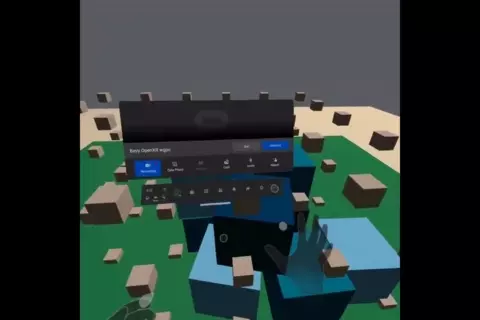

# Introduction

Proof-of-concept of getting [OpenXR](https://www.khronos.org/openxr/) rendering support for [Bevy](https://github.com/bevyengine/bevy) game engine using [gfx-rs](https://github.com/gfx-rs/gfx/) abstractions.

 

Please note that the code with this PoC has not been merged upstream yet. Consider this code as a PoC where you can get things running, but there will be unstability.

## Install

### Windows

Tested with Oculus Quest 2 using Oculus Link in Virtual Desktop mode (must be enabled before starting app).

Clone this repository and run [install_dependencies.bat](./install_dependencies.bat) to download required dependencies (patched bevy, wgpu, openxrs crates, etc.):

    git clone https://github.com/blaind/xrbevy.git
    .\install_dependencies.bat

Run the example scene using [Rust](https://www.rust-lang.org/).

    cargo run --example xr_pc_scene --release

If you don't already have an openxr loader, the process will complain about missing `openxr_loader.dll` file. One way to have a loader is to use a Khronos loader:

1. Open https://github.com/KhronosGroup/OpenXR-SDK-Source/releases/
1. Look for the latest release and a file called `openxr_loader_windows-[version].zip`
1. Copy a file from zip file location `openxr_loader_windows\x64\bin\openxr_loader.dll` into the `xrbevy` path (or global library load path?).

The loader must also be configured to point into correct runtime. This depends on your hardware manufacturer. For Oculus, you need to first download [Oculus app](https://www.oculus.com/setup/). Then you must point the Khronos Openxr loader to the Oculus runtime:

1. Open regedit as Administrator
1. Navigate to Computer\HKEY_LOCAL_MACHINE\SOFTWARE\Khronos\OpenXR\1
1. Change ActiveRuntime value to C:\Program Files\oculus\Support\oculus-runtime\oculus_openxr_64.json

See also [troubleshooting](#troubleshooting)

### Ubuntu

**Note: tested only with Monado in virtual desktop mode, not with real hardware**

Install needed dependencies:

    sudo apt-get install make libudev-dev libasound2-dev

Clone this repository and run a [Makefile](./Makefile) command to download required dependencies (patched bevy, wgpu, openxrs crates, etc.):

    git clone https://github.com/blaind/xrbevy.git
    make download_dependencies

Run the example scene using [Rust](https://www.rust-lang.org/):

    cargo run --example xr_pc_scene --release

If you don't already have an openxr loader, the process will complain about missing `openxr_loader.dll` file. Please try first One way to install a loader is to use [Monado](https://monado.dev/) loader. Ubuntu installation:

    sudo add-apt-repository ppa:monado-xr/monado
    sudo apt-get update
    sudo apt-get install libopenxr-loader1

In addition to a loader, you'll need an OpenXR runtime: either virtualized like Monado, or real like **maybe** (untested) SteamVR. For Monado, see https://monado.freedesktop.org/getting-started.html#monado. If you find a way to run with real hardware, please contact author or make a pull request to document the steps here.

See also [troubleshooting](#troubleshooting)

### Mac OS

Currently untested. Please make a pull request if you get it working.

### Oculus Quest 2

See [Oculus installation instructions](./docs/install_oculus.md)

# Background

Targets:
1. Demonstrate that OpenXR rendering is possible on Rust/GFX-RS/Bevy -ecosystem
1. Start the discussion with ecosystem participants about proper way to implement OpenXR support for Rust
1. Eventually have the basic building blocks in an easy-to-use state for building XR apps on top of bevy, or implementing XR support for other rendering engines


For technical details, see [docs/architecture.md](docs/architecture.md):

<a href="docs/architecture.md"></a>
<a href="docs/architecture.md"></a><br />

Tracked pull requests at upstream:

* bevy: https://github.com/bevyengine/bevy/pull/2166
* wgpu-rs: https://github.com/gfx-rs/wgpu-rs/pull/910
* wgpu: https://github.com/gfx-rs/wgpu/pull/1387
* gfx-rs: https://github.com/gfx-rs/gfx/pull/3761
* bevy_rapier: https://github.com/dimforge/bevy_rapier/pull/69 (only required for kinematics in the example)
* android-ndk-rs: https://github.com/rust-windowing/android-ndk-rs/pull/138 (needed for bundling .so for Oculus Quest 2)

# Related material

Further reading - some links that have helped in getting this PoC working:

* https://www.khronos.org/registry/OpenXR/specs/1.0/html/xrspec.html
* https://github.com/Ralith/openxrs/blob/master/openxr/examples/vulkan.rs
* https://github.com/GodotVR/godot_openxr

# Troubleshooting

## ERROR_FORM_FACTOR_UNAVAILABLE

    thread 'main' panicked at 'called `Result::unwrap()` on an `Err` value: ERROR_FORM_FACTOR_UNAVAILABLE', repos\gfx\src\backend\vulkan\src\xr.rs:63:14

Solution: Make sure that your device is connected

## OpenXR loader not found

    Could not load openxr loader. Make sure that you have openxr_loader.dll (Windows), libopenxr_loader.dylib (MacOS) or libopenxr_loader.so (Linux) in the library load path

Solution: follow the platform-specific installation instructions, and make sure that one of the above files is present in library load path (or current path).

## Unknown wgpu/OpenXR extension

```
ADD INSTANCE EXTENSION! "VK_KHR_external_memory_capabilities"
ADD INSTANCE EXTENSION! "VK_KHR_external_fence_capabilities"
ADD INSTANCE EXTENSION! "VK_KHR_external_semaphore_capabilities"
ADD DEVICE EXTENSION! "VK_KHR_external_memory"
ADD DEVICE EXTENSION! "VK_KHR_external_memory_win32"
thread 'main' panicked at 'Unknown wgpu/OpenXR extension, add to openxr_extensions! macro: Unknown', repos\gfx\src\backend\vulkan\src\xr.rs:233:26
```

Solution: some of the extensions is missing from xr code. Please open a new issue to this repository, or make a pull request directly into: https://github.com/blaind/gfx/blob/bevy_openxr/src/backend/vulkan/src/xr.rs#L326 (last part with `openx_extensions!` macro). The format is as:

    (VK_KHR_EXTERNAL_SEMAPHORE_WIN32, "VK_KHR_external_semaphore_win32", 1048576),
     ^^^ all uppercase                 ^^ format as specific by OpenXR   ^^ pow2

For the pow2 number, take the max/latest number and multiply it by two to get a next value.