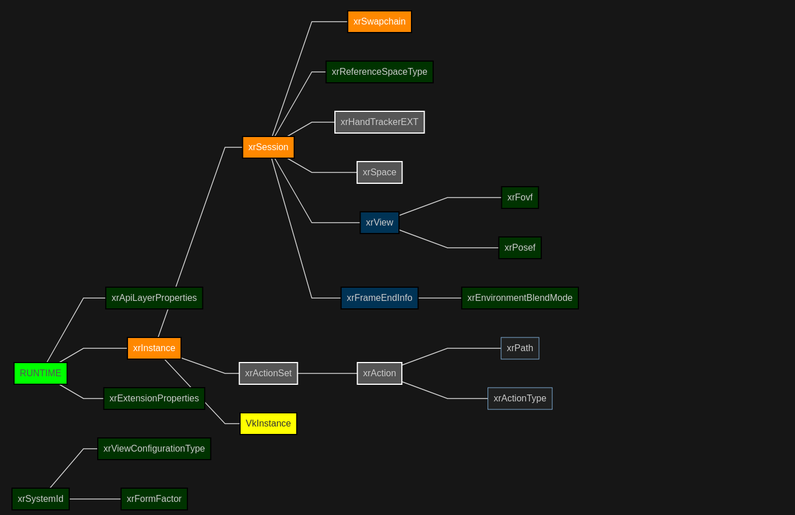
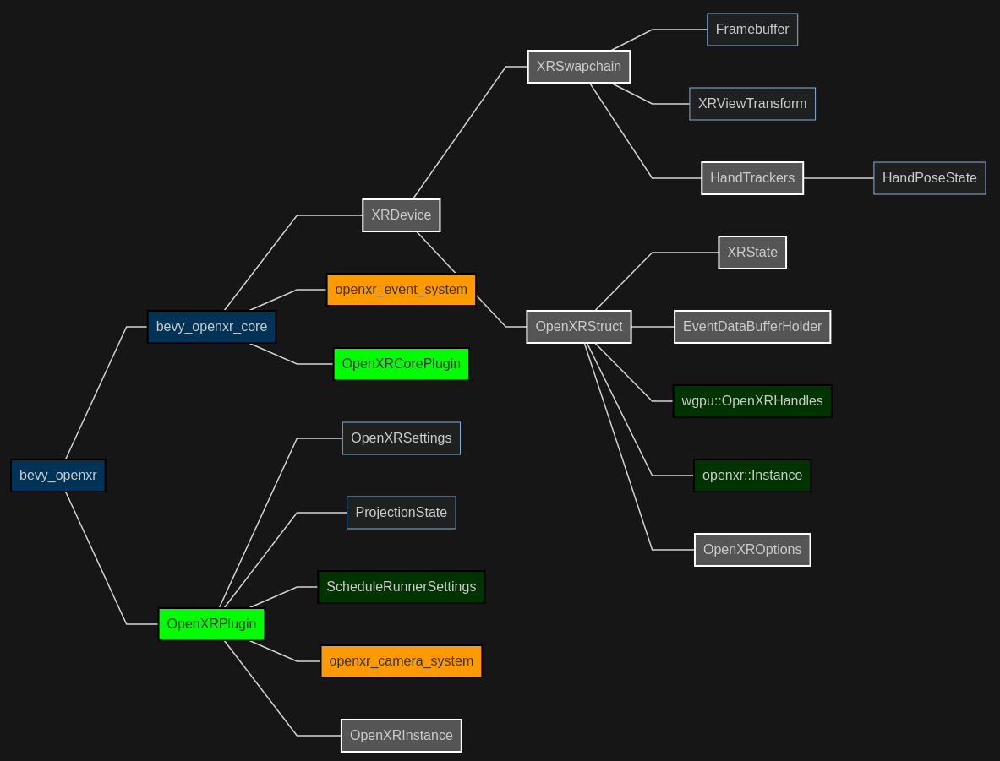
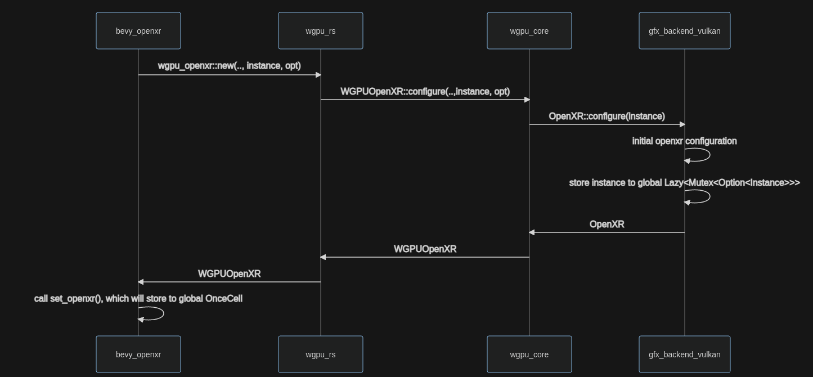
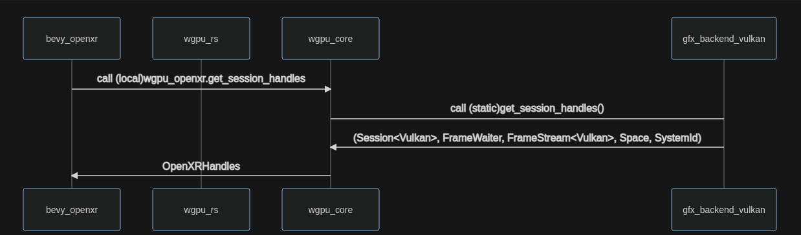

# OpenXR architecture

See https://www.khronos.org/registry/OpenXR/specs/1.0/html/xrspec.html



# Bevy structure



## bevy_openxr_core

A core plugin. Responsibilities:
* Device communication
  * Initialize the underlying openxr - device in co-operation with wgpu/gfx crates
  * Feature configuration? e.g. view mode, FPS, ...
  * Feature detection?
* I/O
  * Output: Fetch and convert input data (controllers, hand tracking, hardware state) into bevy events
  * Input: (none currently, to be planned - use cases are for example haptics in controllers)


Components:
* struct `XRDevice`: currently mostly a wrapper around methods in the swapchain
  * struct `XRSwapchain`: Custom swapchain, which will handle rendering to views. Has prepare, post-update methods. etc.
    * struct `Framebuffer`: One per XR-camera (2 for headsets), contains a `wgpu::Texture` and `wgpu::TextureView`
    * struct `XRViewTransform`: (these are not actually stored inside, but rather there's a getter) -- used for storing per-camera (eye) positions. Like `bevy::Transform`, but has a helper method `compute_matrix()` which is called from `bevy::camera_node`
    * struct `HandTrackers`: left & right hand trackers
      * struct `HandPoseState`: if there are hand-trackers, `get_hand_positions()` method will return hand pose states
  * struct `OpenXRStruct`: poorly named struct, that contains various entities related to XR. Mostly used to bundle all into one `Option<T>`, after `XRDevice` has been initialized. Will be built with `OpenXRStructBuilder`
    * enum `XRState`: current state of the underlying device (running, paused, etc)
    * struct `EventDataBufferHolder`: wraps `openxr::EventDataBuffer`, which contains newly produced (hardware?) events (`openxr::Event`) from openxr. App should react to these
    * struct `wgpu::OpenXRHandles`: container for various OpenXR-related items that are needed on bevy side. Moved from vulkan to bevy (see below)
    * struct `openxr::Instance`: Instance of openxr device. This instance is also used at gfx/vulkan side
    * struct `OpenXROptions`: configuration information (view type, trackers, etc.)

* system `openxr_event_system`: transforms `openxr::Event` into bevy events (currently just `XRState` change-events)

## bevy_openxr

Desired functionality must be scoped better. Initial rationale for dividing into separate crates was to prevent recursive loop between crates.

Responsibilities?

* Providing "simple" HandTracker & Controller plugins for visualizing (& interacting?) in the XR space. These will read the events from core crate, and create/update tracker meshes. Or should these be in separate crates? (`bevy_openxr_hand_tracking`, `bevy_openxr_controller_tracking`, ...)

TODO:
* `OpenXRInstance` and `XRProjection` should probably be located in the core crate.

## community crates

* Fancy hand trackers, controller trackers, etc...?

## TODO

What needs to happen in render loop:
* Swapchain & texture rendering
* Getting controller/hand positions
* Getting head tracking state
* etc..

# Initialization

## 1. Initializing OpenXR on app main

This happens before bevy-code.

* Construct `openxr::Entry` based on platform-specific code
* Construct `openxr::Instance`

## 2. Copying `openxr::Instance` to gfx/vulkan and instantiating `WGPUOpenXR`

This shows the initial OpenXR configuration flow from bevy_openxr to gfx-vulkan. As a part of this flow, Bevy will transfer a copy of `openxr::Instance` to gfx/vulkan.

Notes:

* Currently options are not passed from wgpu_core to vulkan. However, they are probably needed in future
* Vulkan has a global singleton of type `Lazy<Mutex<Option<Instance>>>`, that will contain the `openxr::Instance` (which wraps inner value into an `Arc`)




Bevy will get reference to all the openxr-related handles (inners are wrapped in `Arc`)

For now, bevy will store the required xr-related structs in a global singleton (probably unsafe).

```rust
pub fn set_openxr(wgpu_openxr: wgpu::wgpu_openxr::WGPUOpenXR, openxr_instance: openxr::Instance) {
    unsafe {
        WGPU_INSTANCE
            .set(WgpuData((wgpu_openxr, openxr_instance)))
            .unwrap()
    };
}
```

## 3. Instantiating bevy-openxr (`OpenXRCorePlugin`)

1. Move `WGPUOpenXR` and `openxr::Instance` out of singleton
2. Build `OpenXRStruct`, for which handles are needed (see next step)

(TODO: naming of all these structs is confusing, must come with better names)

## 4. Getting handles from gfx/vulkan

After bevy has initialized itself, it will call through wgpu-rs to get an access to a few openxr-related handles. All of these are defined in `openxr` crate.

Some are returned as moved entities, some are cloned (`Arc`)



gfx_backend_vulkan method for handles:
```rust
pub fn get_session_handles() -> (
    openxr::Session<openxr::Vulkan>,
    openxr::FrameWaiter,
    openxr::FrameStream<openxr::Vulkan>,
    openxr::Space,
    openxr::SystemId,
) {
```

OpenXRHandles used by bevy:
```rust
pub struct OpenXRHandles {
    pub session: openxr::Session<openxr::Vulkan>,
    pub frame_waiter: openxr::FrameWaiter,
    pub frame_stream: openxr::FrameStream<openxr::Vulkan>,
    pub space: openxr::Space,
    pub system: openxr::SystemId,
}
```

## 5. Continue configuration on Bevy-side

(TODO: document)

## 6. Construct `XRSwapchain` on bevy-side

Instead of gfx swapchain, a custom swapchain is used.

As a part of this call, a new wgpu method `device.create_openxr_texture_from_raw_image` will be called

## 7. Render loop

(TODO: document)

