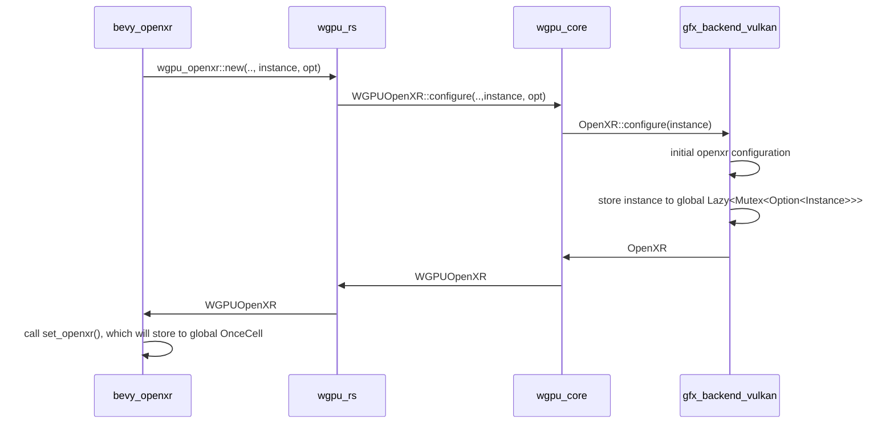
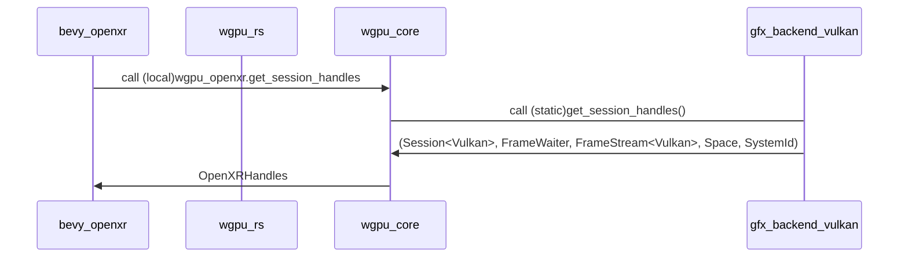

# Initialization

## 1. Initializing OpenXR on app main

This happens before bevy-code.

* Construct `openxr::Entry` based on platform-specific code
* Construct `openxr::Instance`

## 2. Copying `openxr::Instance` to gfx/vulkan and instantiating `WGPUOpenXR`

This shows the initial OpenXR configuration flow from bevy_openxr to gfx-vulkan. As a part of this flow, Bevy will transfer a copy of `openxr::Instance` to gfx/vulkan.

Notes:

* Currently options are not passed from wgpu_core to vulkan. However, they are probably needed in future
* Vulkan has a global singleton of type `Lazy<Mutex<Option<Instance>>>`, that will contain the `openxr::Instance` (which wraps inner value into an `Arc`)




Bevy will get reference to all the openxr-related handles (inners are wrapped in `Arc`)

For now, bevy will store the required xr-related structs in a global singleton (probably unsafe).

```rust
pub fn set_openxr(wgpu_openxr: wgpu::wgpu_openxr::WGPUOpenXR, openxr_instance: openxr::Instance) {
    unsafe {
        WGPU_INSTANCE
            .set(WgpuData((wgpu_openxr, openxr_instance)))
            .unwrap()
    };
}
```

## 3. Instantiating bevy-openxr (`OpenXRCorePlugin`)

1. Move `WGPUOpenXR` and `openxr::Instance` out of singleton
2. Build `OpenXRStruct`, for which handles are needed (see next step)

(TODO: naming of all these structs is confusing, must come with better names)

## 4. Getting handles from gfx/vulkan

After bevy has initialized itself, it will call through wgpu-rs to get an access to a few openxr-related handles. All of these are defined in `openxr` crate.

Some are returned as moved entities, some are cloned (`Arc`)




gfx_backend_vulkan method for handles:
```rust
pub fn get_session_handles() -> (
    openxr::Session<openxr::Vulkan>,
    openxr::FrameWaiter,
    openxr::FrameStream<openxr::Vulkan>,
    openxr::Space,
    openxr::SystemId,
) {
```

OpenXRHandles used by bevy:
```rust
pub struct OpenXRHandles {
    pub session: openxr::Session<openxr::Vulkan>,
    pub frame_waiter: openxr::FrameWaiter,
    pub frame_stream: openxr::FrameStream<openxr::Vulkan>,
    pub space: openxr::Space,
    pub system: openxr::SystemId,
}
```

## 5. Continue configuration on Bevy-side

(TODO: document)

## 6. Construct `XRSwapchain` on bevy-side

Instead of gfx swapchain, a custom swapchain is used.

As a part of this call, a new wgpu method `device.create_openxr_texture_from_raw_image` will be called

## 7. Render loop

(TODO: document)

