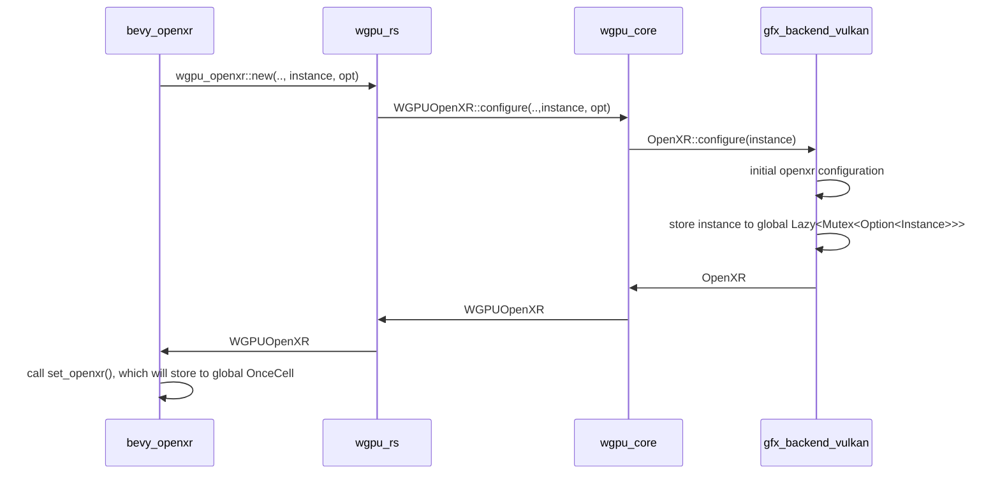
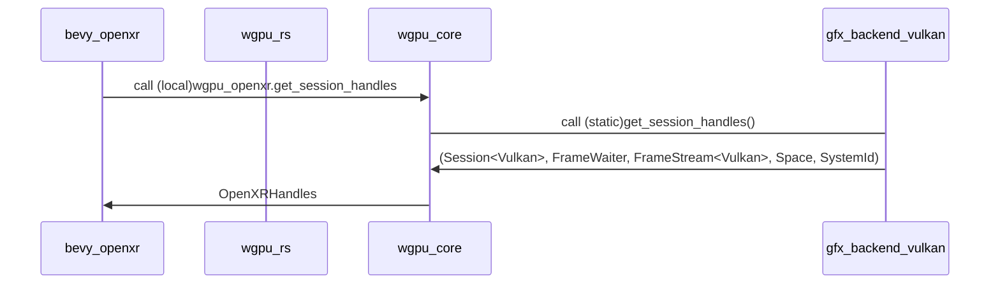

# screenshot 0

```mermaid
graph LR
    style XRD fill:#555555,stroke:#fff,stroke-width:2px
    style XRSC fill:#555555,stroke:#fff,stroke-width:2px
    style OXRS fill:#555555,stroke:#fff,stroke-width:2px
    style XRS fill:#555555,stroke:#fff,stroke-width:2px
    style EDBH fill:#555555,stroke:#fff,stroke-width:2px
    style XRO fill:#555555,stroke:#fff,stroke-width:2px
    style XRHT fill:#555555,stroke:#fff,stroke-width:2px
    style XRI2 fill:#555555,stroke:#fff,stroke-width:2px

    style ScheduleRunnerSettings fill:#003300,stroke:#000,stroke-width:2px
    style XRH fill:#003300,stroke:#000,stroke-width:2px
    style XRI fill:#003300,stroke:#000,stroke-width:2px

    style BO fill:#003355,stroke:#000,stroke-width:2px
    style BOC fill:#003355,stroke:#000,stroke-width:2px

    style s_E fill:#ff9900,stroke:#000,stroke-width:2px,color:#333
    style s_CA fill:#ff9900,stroke:#000,stroke-width:2px,color:#333

    style XRCP fill:#00ff00,stroke:#000,stroke-width:2px,color:#333

    style XRP fill:#00ff00,stroke:#000,stroke-width:2px,color:#333

    BO[bevy_openxr] --- BOC[bevy_openxr_core]

    XRD --- XRSC[XRSwapchain]
    XRSC --- Framebuffer
    BOC --- XRD[XRDevice]
    BOC --- s_E[openxr_event_system]
    XRD --- OXRS[OpenXRStruct]
    OXRS --- XRS[XRState]
    OXRS --- EDBH[EventDataBufferHolder]
    OXRS --- XRH[wgpu::OpenXRHandles]
    OXRS --- XRI[openxr::Instance]
    OXRS --- XRO[OpenXROptions]
    XRSC --- XRVT[XRViewTransform]
    XRSC --- XRHT[HandTrackers]
    XRHT --- XRHPS[HandPoseState]

    BOC --- XRCP[OpenXRCorePlugin]

    BO --- XRP[OpenXRPlugin]

    XRP --- XRS2[OpenXRSettings]
    XRP --- PS[ProjectionState]
    XRP --- ScheduleRunnerSettings
    XRP --- s_CA[openxr_camera_system]
    XRP --- XRI2[OpenXRInstance]


```

# screenshot 1

```mermaid
sequenceDiagram
    participant bevy_openxr
    participant wgpu_rs
    participant wgpu_core
    participant gfx_backend_vulkan

    bevy_openxr->>wgpu_rs: wgpu_openxr::new(.., instance, opt)
    wgpu_rs->>wgpu_core: WGPUOpenXR::configure(..,instance, opt)

    wgpu_core->>gfx_backend_vulkan: OpenXR::configure(instance)

    gfx_backend_vulkan->>gfx_backend_vulkan: initial openxr configuration
    gfx_backend_vulkan->>gfx_backend_vulkan: store instance to global Lazy<Mutex<Option<Instance>>>

    gfx_backend_vulkan->>wgpu_core: OpenXR

    wgpu_core->>wgpu_rs: WGPUOpenXR

    wgpu_rs->>bevy_openxr: WGPUOpenXR

    bevy_openxr->>bevy_openxr: call set_openxr(), which will store to global OnceCell
```

# screenshot 2

```mermaid
sequenceDiagram
    participant bevy_openxr
    participant wgpu_rs
    participant wgpu_core
    participant gfx_backend_vulkan

    bevy_openxr->>wgpu_core: call (local)wgpu_openxr.get_session_handles

    wgpu_core->gfx_backend_vulkan: call (static)get_session_handles()

    gfx_backend_vulkan->>wgpu_core: (Session<Vulkan>, FrameWaiter, FrameStream<Vulkan>, Space, SystemId)

    wgpu_core->>bevy_openxr: OpenXRHandles

```
