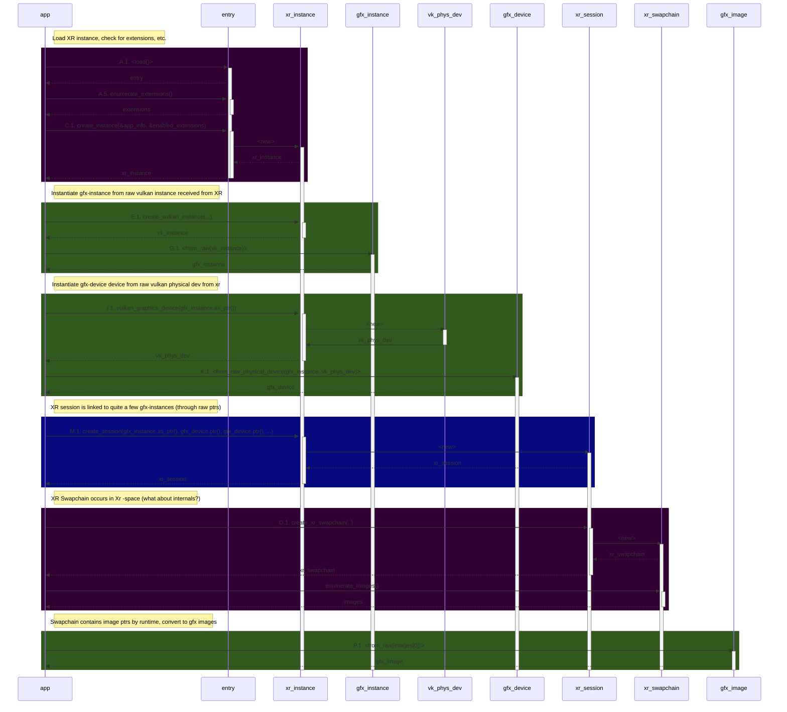
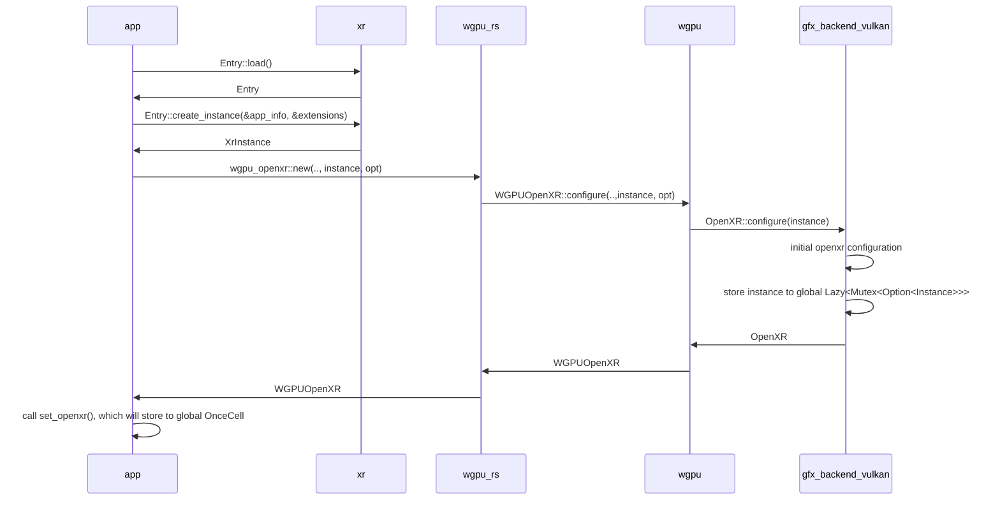

# screenshot 1

```mermaid
sequenceDiagram
    participant app
    participant entry
    participant xr_instance
    participant gfx_instance
    participant vk_phys_dev
    participant gfx_device
    participant xr_session
    participant xr_swapchain
    participant gfx_image

    Note right of app: Load XR instance, check for extensions, etc.
    rect rgb(50, 0, 50)
        app->>entry: A.1. <load()>
        activate entry
        activate entry
        entry-->>app: entry

        app->>+entry: A.5. enumerate_extensions()
        entry-->>-app: extensions

        app->>+entry: C.1. create_instance(&app_info, &enabled_extensions)

        entry->>+xr_instance: <new>
        activate xr_instance

        xr_instance-->>entry: xr_instance
        entry-->>-app: xr_instance
        deactivate entry
    end

    Note right of app: Instantiate gfx-instance from raw vulkan instance received from XR
    rect rgb(50, 90, 30)
        app->>+xr_instance: E.1. create_vulkan_instance(...)
        xr_instance-->>-app: vk_instance

        app->>gfx_instance: G.1. <from_raw(vk_instance)>
        activate gfx_instance
        gfx_instance-->>app: gfx_instance
    end

    Note right of app: Instantiate gfx-device device from raw vulkan physical dev from xr
    rect rgb(50, 90, 30)
        app->>+xr_instance: I.1. vulkan_graphics_device(gfx_instance.as_ptr())
        xr_instance->>vk_phys_dev: <new>
        activate vk_phys_dev
        vk_phys_dev->>xr_instance: vk_phys_dev
        deactivate vk_phys_dev
        xr_instance-->>-app: vk_phys_dev

        app->>gfx_device: K.1. <from_raw_physical_device(gfx_instance, vk_phys_dev)>
        activate gfx_device
        gfx_device-->>app: gfx_device
    end

    Note right of app: XR session is linked to quite a few gfx-instances (through raw ptrs)
    rect rgb(10, 10, 128)
        app->>+xr_instance: M.1. create_session(gfx_instance.as_ptr(), gfx_device.ptr(), gfx_device.ptr(), ...)

        xr_instance->>xr_session: <new>
        activate xr_session

        xr_session-->>xr_instance: xr_session

        xr_instance-->>-app: xr_session
    end

    Note right of app: XR Swapchain occurs in Xr -space (what about internals?)
    rect rgb(50, 0, 50)
        app->>+xr_session: O.1. create_xr_swapchain(..)
        xr_session->>xr_swapchain: <new>
        activate xr_swapchain
        xr_swapchain-->>xr_session: xr_swapchain
        xr_session-->>-app: xr_swapchain

        app->>+xr_swapchain: enumerate_images()
        xr_swapchain-->>-app: images
    end

    Note right of app: Swapchain contains image ptrs by runtime, convert to gfx images
    rect rgb(50, 90, 30)
        app->>gfx_image: P.1. <from_raw(images[0])>
        activate gfx_image
        gfx_image-->>app: gfx_image
    end


    deactivate xr_session
    deactivate gfx_instance
    deactivate xr_instance
    deactivate xr_swapchain
    deactivate gfx_image
    deactivate gfx_device
```

```mermaid
sequenceDiagram
    participant app
    participant xr
    participant wgpu_rs
    participant wgpu
    participant gfx_backend_vulkan

    app->>xr: Entry::load()
    xr->>app: Entry

    app->>xr: Entry::create_instance(&app_info, &extensions)
    xr->>app: XrInstance


    app->>wgpu_rs: wgpu_openxr::new(.., instance, opt)
    wgpu_rs->>wgpu: WGPUOpenXR::configure(..,instance, opt)

    wgpu->>gfx_backend_vulkan: OpenXR::configure(instance)

    gfx_backend_vulkan->>gfx_backend_vulkan: initial openxr configuration
    gfx_backend_vulkan->>gfx_backend_vulkan: store instance to global Lazy<Mutex<Option<Instance>>>

    gfx_backend_vulkan->>wgpu: OpenXR

    wgpu->>wgpu_rs: WGPUOpenXR

    wgpu_rs->>app: WGPUOpenXR

    app->>app: call set_openxr(), which will store to global OnceCell
```
