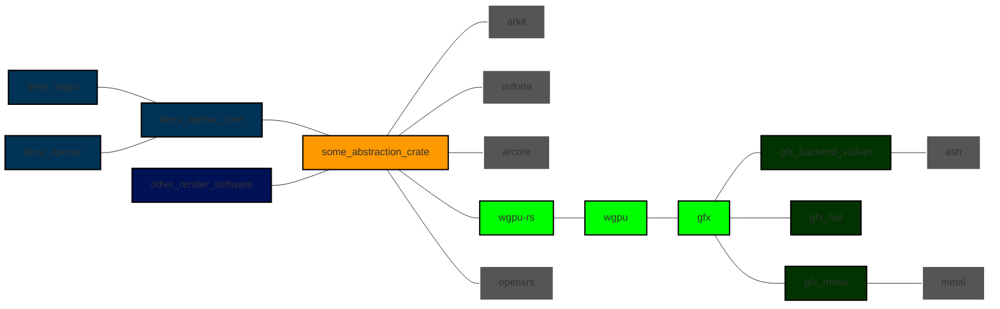

# screenshot 0

```mermaid
graph LR
    style BW fill:#003355,stroke:#000,stroke-width:2px

    style OC fill:#003355,stroke:#000,stroke-width:2px

    style O fill:#003355,stroke:#000,stroke-width:2px

    style AB fill:#ff9900,stroke:#000,stroke-width:2px,color:#333

    style ORS fill:#001155,stroke:#000,stroke-width:2px

    style AK fill:#555555,stroke:#fff,stroke-width:2px

    style VU fill:#555555,stroke:#fff,stroke-width:2px

    style AC fill:#555555,stroke:#fff,stroke-width:2px

    style AC fill:#555555,stroke:#fff,stroke-width:2px

    style GR fill:#00ff00,stroke:#000,stroke-width:2px,color:#333

    style GRRS fill:#00ff00,stroke:#000,stroke-width:2px,color:#333

    style GFX fill:#00ff00,stroke:#000,stroke-width:2px,color:#333


    style GV fill:#003300,stroke:#000,stroke-width:2px

    style GH fill:#003300,stroke:#000,stroke-width:2px

    style GM fill:#003300,stroke:#000,stroke-width:2px

    style ash fill:#555555,stroke:#fff,stroke-width:2px

    style metal fill:#555555,stroke:#fff,stroke-width:2px

    style OX fill:#555555,stroke:#fff,stroke-width:2px


    BW[bevy_wgpu] --- OC[bevy_openxr_core]
    O[bevy_openxr] --- OC

    GRRS --- GR[wgpu]
    GR --- GFX[gfx]

    GFX --- GH[gfx_hal]
    GFX --- GV[gfx_backend_vulkan]
    GFX --- GM[gfx_metal]

    GV --- ash
    GM --- metal


    OC --- AB[some_abstraction_crate]
    AB --- OX[openxrs]

    AB --- GRRS[wgpu-rs]

    AB --- AK[arkit]
    AB --- VU[vuforia]
    AB --- AC[arcore]

    ORS[other_render_software] --- AB


```